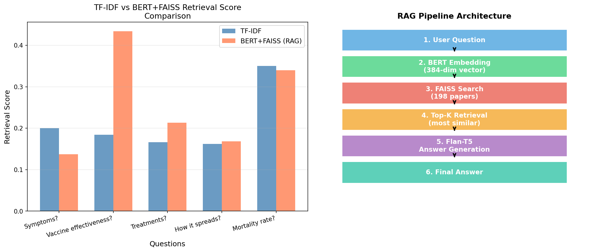

# Medical Research Paper Q&A System using RAG-BERT

## Overview
This project implements a Retrieval-Augmented Generation (RAG) pipeline to answer medical research questions using BERT embeddings and FAISS-based retrieval.

---

## Problem Statement
Traditional keyword-based search (TF-IDF) often fails to capture semantic meaning in medical queries.  
This project improves retrieval quality using dense embeddings and similarity search.

---

## Approach

1. User inputs a question  
2. Convert query into embeddings using BERT  
3. Perform similarity search using FAISS  
4. Retrieve top-K relevant research papers  
5. Generate final answer using Flan-T5  

---

## Pipeline Architecture

- User Question  
- BERT Embedding  
- FAISS Retrieval  
- Top-K Selection  
- Answer Generation (Flan-T5)  
- Final Answer  

---

## Results

Comparison between TF-IDF and RAG (BERT + FAISS):

- RAG shows better retrieval performance  
- Significant improvement in semantic understanding  
- More relevant document retrieval  

---

## Visualization

---

## Tech Stack

- Python  
- BERT (Embeddings)  
- FAISS (Similarity Search)  
- Flan-T5 (Answer Generation)  
- Pandas, NumPy  

---

## Files

- `Final_Project_STAT653.ipynb` → Main implementation  
- `rag_results.xlsx` → Evaluation results  
- `rag_comparison.png` → Visualization  

---

## Future Improvements

- Fine-tune domain-specific BERT model  
- Improve retrieval ranking  
- Deploy as API  
